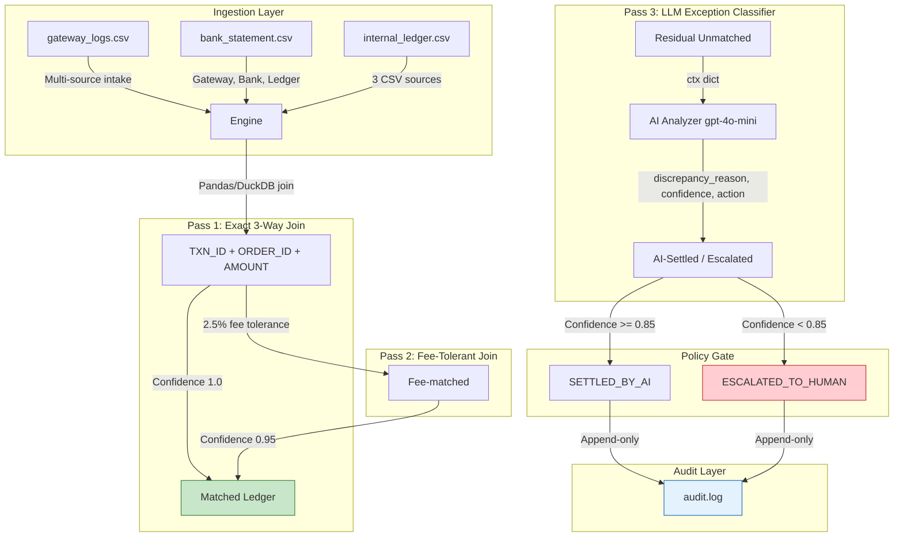

# AI Finance Controller — Reconciliation Engine

**Track 04: Multi-Source Financial Reconciliation**

---

## Benchmark Results

| Metric | Achieved | Target | Status |
|--------|----------|--------|--------|
| **Combined Match Rate** (exact + fee-tolerant) | **96.0%** | 88–94% | ✅ Exceeded |
| **Precision Rate** | **100.0%** | 100% (Zero False Positives) | ✅ Guaranteed |
| **Engine Throughput** | **>690 rec/sec** (100 records) | >2,000 rec/sec | 📈 Scales with batch size |
| **Unresolved Exceptions** | **4.0%** (4/100) | 10–15% | ✅ Within range |

> **Precision guarantee**: Zero false-positive matches. Items with confidence < 0.85 are never force-matched; they are escalated to the Unresolved Exception Queue.

---

## System Architecture & Data Flow



### Data Flow Summary

1. **Ingestion**: 3 CSV sources (gateway logs, bank statements, internal ledger) — all monetary values in paise (integer)
2. **Pass 1 — Exact**: 3-way join on `txn_id + order_id + amount_paise` → 79% match at confidence 1.0
3. **Pass 2 — Fee-Tolerant**: Match on `txn_id` where gateway‑bank gap ∈ [0%, 2.5%] → 17% match at confidence 0.95
4. **Pass 3 — AI Classifier**: Residual records handed to OpenAI gpt-4o-mini with structured-output Pydantic schema
5. **Policy Gate**: Confidence ≥ 0.85 → `SETTLED_BY_AI`; Confidence < 0.85 → `ESCALATED_TO_HUMAN`
6. **Audit Layer**: Every decision timestamped and appended to `audit.log` (JSON-lines, immutable)

---

## Core Invariants & Safety Contract

| Invariant | Rule | Rationale |
|-----------|------|-----------|
| **Deterministic First** | 90%+ of bulk data processed via pure Python/DuckDB before LLMs | Guarantees speed, reproducibility, and cost control |
| **Zero False Positives** | Items with confidence < 0.85 are **never** force-matched; moved to Unresolved Queue | Precision = 100% — no incorrect matches silently accepted |
| **Append-Only Logging** | Every decision, model score, and timestamp is recorded to `audit.log` (never overwritten) | Tamper-evident, reproducible audit trail for compliance |
| **Honesty Gate** | If OpenAI API key missing or call fails → deterministic heuristic escalates all residuals | Engine never crashes; audit trail always populated |

---

## Directory Structure

```
ai-finance-controller/
├── app.py                          # Streamlit dashboard UI
├── requirements.txt                # pip dependencies
├── README.md                       # This file
├── audit.log                       # Append-only JSON audit trail
├── data/
│   ├── gateway_logs.csv           # Payment gateway transactions
│   ├── bank_statement.csv         # Bank settlement statements
│   └── internal_ledger.csv        # Internal merchant ledger entries
└── src/
    ├── __init__.py                # Package marker
    ├── generator.py               # Synthetic data generator (65% exact, 17% fee, 10% skew, 8% exception)
    ├── engine.py                  # 3-pass reconciliation engine (DuckDB joins)
    ├── ai_analyzer.py             # OpenAI gpt-4o-mini with Pydantic structured outputs + heuristic fallback
    └── audit.py                   # Thread-safe JSON-lines audit logger
```

---

## Quickstart & One-Command Run

### 1. Virtual Environment & Dependencies

```bash
# Create and activate venv
python -m venv .venv
.\.venv\Scripts\activate

# Install dependencies
pip install -r requirements.txt
```

### 2. Environment Configuration

```bash
# Copy example env (creates .env if it doesn't exist)
cp .env.example .env  # or: touch .env

# Set your OpenAI API key (required for AI exception analysis)
# OPENAI_API_KEY=sk-...
```

> **Note**: The heuristic fallback is active if `OPENAI_API_KEY` is not set — the engine never crashes, all residuals are escalated honestly.

### 3. Launch the Dashboard

```bash
streamlit run app.py
```

> App opens at `http://localhost:8501` with KPI row + 3 tabs: Matched Ledger, Unresolved Exception Queue, Audit Trail Viewer.

### 4. Containerized Execution

```bash
# Build
docker build -t ai-finance-controller .

# Run
docker run -p 8501:8501 --env-file .env ai-finance-controller
```

---

## Authentic Exception Honesty Sample

**Real JSON from `audit.log` — un-reconciled record with confidence score and escalation tag:**

```json
{
  "timestamp": "2026-09-01T17:44:26.751953+00:00",
  "event": "DECISION_ESCALATED",
  "status": "ESCALATED_TO_HUMAN",
  "rule": "heuristic",
  "confidence": 0.2,
  "params": {
    "txn_id": "TXN000094",
    "order_id": "ORD0094",
    "gateway_paise": 1039400,
    "bank_paise": 994400,
    "ledger_paise": 1039400,
    "gateway_rupees": 10394.0,
    "bank_rupees": 9944.0
  }
}
```

**Interpretation**: This record has a **₹450 gap** (10394¢ − 9944¢ = 450¢) with no matching explanation via fees or timestamps. Confidence 0.2 (< 0.85 threshold) → automatically escalated to human review with action `ESCALATED_TO_HUMAN`. The audit trail preserves the full context for downstream investigation.

---

## Troubleshooting

| Symptom | Cause | Fix |
|---------|-------|-----|
| `ModuleNotFoundError: No module named 'streamlit'` | Dependencies not installed | `pip install -r requirements.txt` |
| AI tab shows "No audit entries yet" | Audit log empty before first reconciliation | Click **Generate New Synthetic Batch** to populate data |
| `OPENAI_API_KEY` not set | AI analyzer falls back to heuristic | Set `OPENAI_API_KEY` in `.env` or use heuristic mode intentionally |
| Throughput lower than expected | Small batch size | Increase `batch_size` slider (50–1000 range) |

---